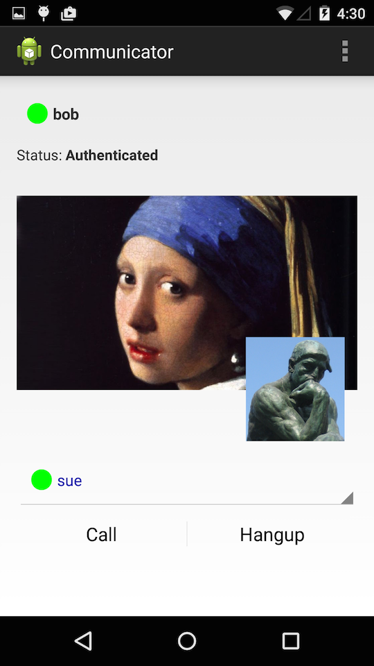
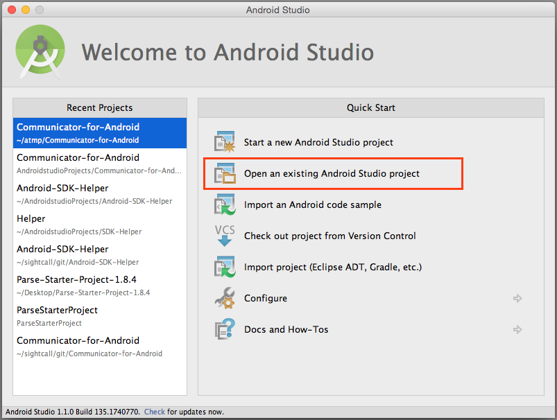
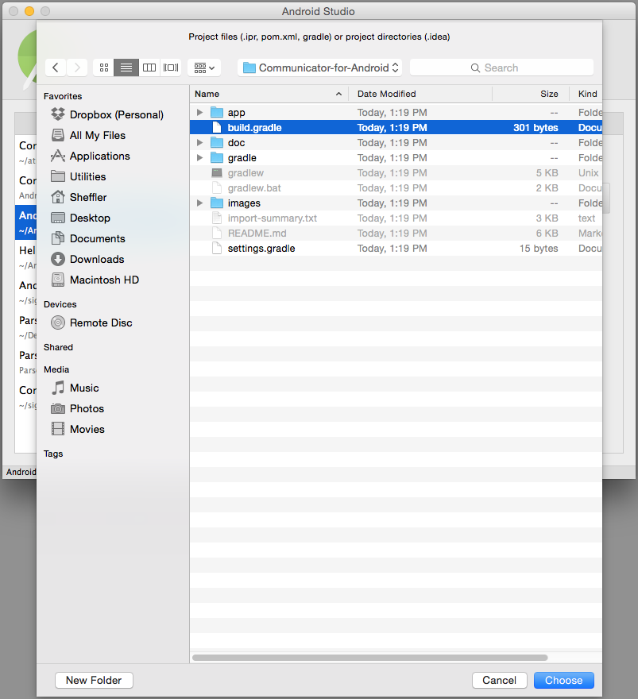
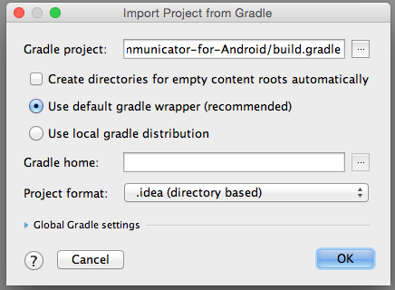
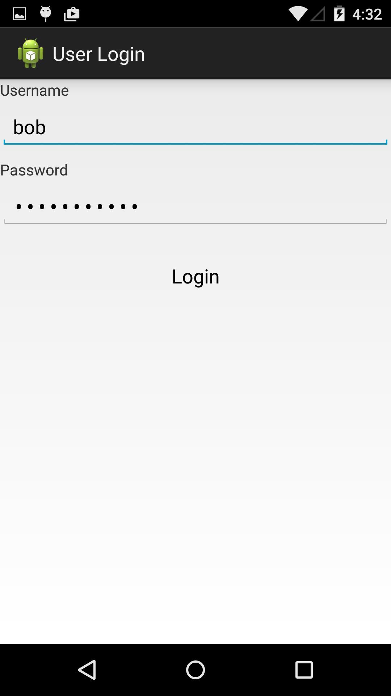
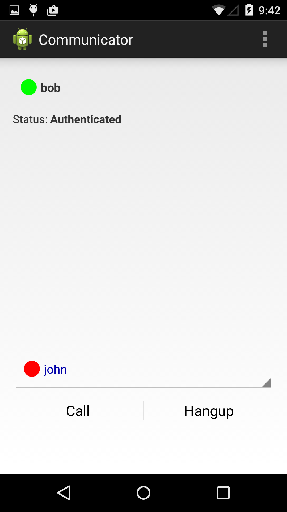
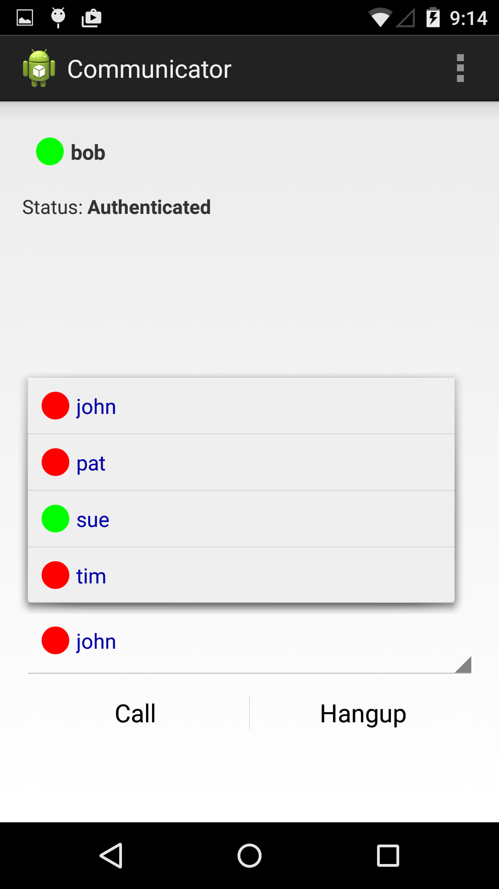
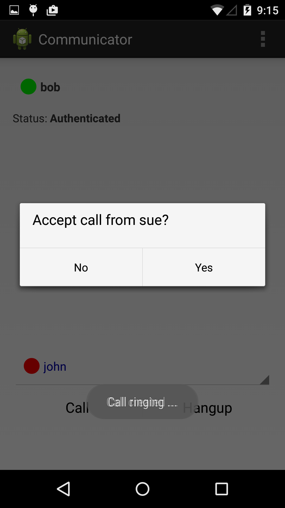
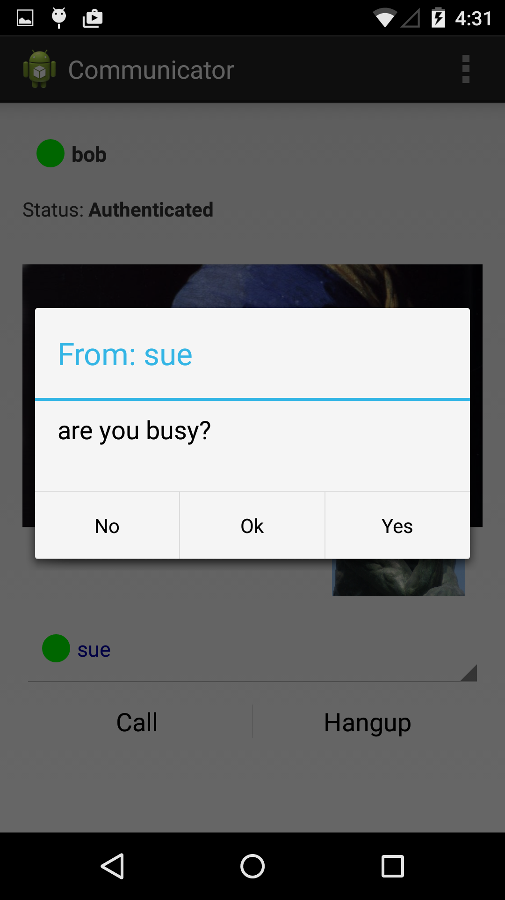
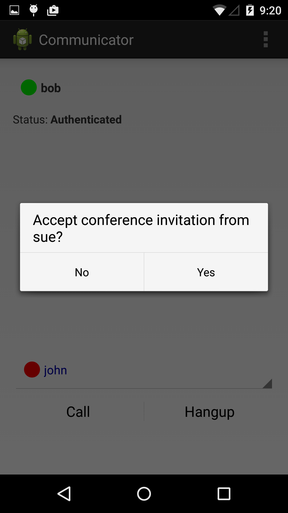

SightCall Communicator-for-Android
==================================

SightCall Communicator-for-Android is a **reference implementation**
for a mobile application showcasing real-time communications for a
small workgroup.  It is implemented as a small Android application
with a single Main activity.  Communicator demonstrates real-time
services and shows how to layer the SightCall platform into a host
Android application.  It shows the following features.

- one-to-one video and voice
- multiparty video-teleconference
- text-chat
- presence
- recording (optional)

Communicator-for-Android uses a ReST API to authenticate and to obtain
its list of users.  Thus, a prerequisite for running this App is an
installed instance of "Communicator-for-Rails"
(https://github.com/sightcall/Communicator).  We recommend getting a
free [Heroku](http://heroku.com) account to get started.

Communicator-for-Android is easy to clone and compile.  Read on!




## Build Instructions

Clone this project to your local filesystem.

```sh
    % git clone git@github.com:sightcall/Communicator-for-Android.git
```

These instructions are for Android Studio.

- Choose "Open existing Android Studio" project.



- Navigate to the directory created by the Clone command above.

- Select the "build.gradle" file and press "Choose".



- In "Import project from Gradle" press "OK".



- Android Studio will begin processing your files.


Now, select the file `Communicator/src/com.sightcall.api/Api.java` for editing.

Change the following line to match the URL of your Communicator-for-Rails instance.

    final String baseurl = "https://sightcall-communicator.herokuapp.com/api";

You can Run the App on an Android device with an Arm7 processor.  (Note:
you cannot run this app on an emulator.)


- Select "Run 'app'" in the Menu, and choose an attached Android Device.


## Short Feature Overview

Communicator-for-Android implements the functionality required to be a
good partner to Communicator-for-Rails.  It can make and receive
calls, and it displays the online presence of all the users in the
group.

Some features, like conferencing and texting have a reduced user
interface that make it better-suited to be a subordinate of a
Web-based user.

### Login

The login page asks for the same Username and Password that you use to log into Communicator-for-Rails on the web.



After you log in you will see the following blank page.  Your Username
and Presence status will be shown at the top.  At the bottom is one of
the friends in the list of your contacts.  Each contact shows their
online presence as a colored circle.  The two buttons at the bottom
make a call and hangup a call.



To logout, use the menu item.


### Make an outgoing call

Put your finger on the spinner to reveal your list of friends.  Select
the friend you want to call and press the "Call" button.



If the other party accepts, you will be connected in a one-to-one
video call, and the name of the party will be highlighted in the
Friend selector.


### Receive an incoming call

If someone tries to call you, you will be presented an Incoming Call
dialog.  You can choose to accept or reject the call.




### Receive a Text Message

A web-based user can send you a text message.  You can respond with
one of three pre-defined answers.




### Join a conference call

A web-based user can invite you to join a multi-way conference call.
In that case, you will be presented the following dialog.  In a
conference, you will see one user at a time --- the user who is
speaking.  We call this the "active speaker."



All SightCall conference calls can be **Recorded** to Amazon S3.  A
mobile call from Android is no different.  The controls for recording
are in the web interface, so the conference and its recording should be
set there.


## The API provided by Communicator-for-Rails

The API that Communicator-for-Android makes use of queries the
following four endpoints.  Implement similar endpoints in your own
web-application if you would like to connect Communicator-for-Android
to it.

    GET /api/me        -- check my password and return 
    GET /api/token     -- obtain a SightCall authentication token
    GET /api/appid     -- retrieve the SightCall App ID of this installation
    GET /api/friends   -- get a list of my friends


If you want to learn about the API consumed by
Communicator-for-Android you can explore it using `curl`.  Try these commands to learn about the JSON data returned.


    curl -u bob:bobpassword https://thawing-harbor-4536.herokuapp.com/api/me

Using the username 'bob' with the password 'bobpassword' you should receive your username and UID in return.

    curl -u bob:bobpassword https://thawing-harbor-4536.herokuapp.com/api/friends

This should return bob's list of friends.

    curl -u bob:bobpassword https://thawing-harbor-4536.herokuapp.com/api/token

This should return an authentication token for user 'bob'.

    curl -u bob:bobpassword https://thawing-harbor-4536.herokuapp.com/api/token

This should return the AppID of the instance of Communicator-for-Rails.


## Implementation Notes

See the following document
[Implementation Notes](doc/IMPLEMENTATIONNOTES.md) in the `doc/`
directory of this repository.  It talks about some of the design
decisions made in the construction of this source code.


